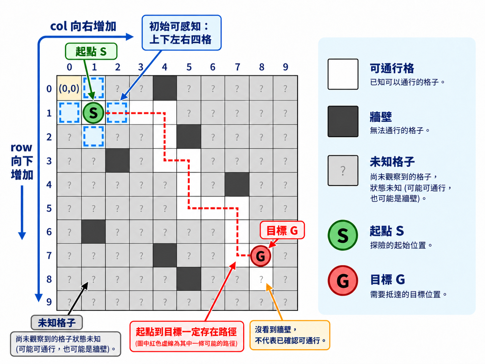

# HW2：Unknown-Map Exploration Agent

## 1. 作業目標

設計一個能在未知格子地圖（grid map）中自主探索的 Agent。Agent 一開始知道地圖大小與起點，但不知道牆壁和目標（goal）的位置；每一步只能感知目前位置及上下左右四格的狀態。

你需要自行記錄已知地圖與探索資訊、決定下一步方向，並在步數限制內走進目標格。

- **走進目標即完成該張地圖，不需要探索所有格子。**
- 可以回頭或重複經過同一格；你應避免的是無法繼續探索的無限繞圈。
- 本作業不限演算法，可以使用 DFS、BFS、A* 或其他方法。若使用路徑搜尋，仍需自行決定在目標位置未知時如何探索。
- 成功後，移動越有效率、碰撞越少，分數越高；成功不代表滿分。

## 2. 檔案說明

| 檔案 | 內容 | 說明 |
|---|---|---|
| `README.md` | 作業規格、執行方式與評分標準 | 作業說明 |
| `map_example.png` | 地圖示意圖 | `README.md` 使用的說明圖片，不需修改 |
| `agent.py` | `MOVES` 方向定義及 `Agent` 介面 | **實作探索策略，唯一需修改與繳交的檔案** |
| `environment.py` | 地圖載入、感知、移動、碰撞計數、成功與步數上限判定 | 不需修改 |
| `public_grader.py` | 執行三張公開地圖並顯示結果 | 執行測試，不需修改 |
| `maps/` | 三張公開測試地圖 | 供測試工具使用，不需修改 |

請在 `agent.py` 中完成：

1. 儲存已知地圖與探索狀態；資料結構自行設計，不要求固定的二維陣列格式。
2. 在 `act()` 中依感知決定下一步。
3. 在 `reset()` 中清除上一張地圖的狀態。

可以在同一份 `agent.py` 中增加輔助方法、類別和標準函式庫匯入，但必須保留指定介面。

## 3. 地圖與座標

下圖為地圖示意圖。Agent 一開始只知道地圖大小、起點位置，以及目前位置上下左右四格的狀態；其餘尚未觀察到的格子皆視為未知。



- 地圖尺寸為 `10×10`、`15×15` 或 `20×20`。
- 座標使用 `(row, col)`，左上角為 `(0, 0)`；row 向下增加，col 向右增加。
- 起點到目標一定存在路徑；起點不是目標，目標也不會出現在初始感知的上下左右四格。
- 尚未觀察到的格子狀態未知；沒有看到牆壁，不代表已確認該格可通行。

每張地圖的步數上限為 `4 * rows * cols`，包含移動與碰撞：

| 地圖尺寸 | 最大動作次數 |
|---|---:|
| 10×10 | 400 |
| 15×15 | 900 |
| 20×20 | 1600 |

用完步數仍未抵達目標，該張地圖失敗。

## 4. 感知資訊（Percept）

每次呼叫 `act(percept)` 時，`percept` 都包含：

```python
{
    "position": (4, 7),
    "neighbors": {
        "UP": "FREE",
        "DOWN": "WALL",
        "LEFT": "FREE",
        "RIGHT": "GOAL",
    },
}
```

- `position`：Agent 當下的實際座標，格式為 `(row, col)`。
- `neighbors`：四個方向都會提供，值只會是下表的三種字串。

| 值 | 意義 |
|---|---|
| `FREE` | 可通行的一般格子 |
| `WALL` | 牆壁或地圖邊界；感知不會另外區分這兩者 |
| `GOAL` | 目標格子，可以走入 |

感知只涵蓋上下左右相鄰的一格，不能看到對角線或更遠的格子，也不提供整張地圖。目標只有在相鄰四格時才會被回報為 `GOAL`。

上述例子中，回傳 `"RIGHT"` 會移動到 `(4, 8)` 並成功；回傳 `"DOWN"` 會撞牆，停留在 `(4, 7)`。

## 5. 動作（Action）與移動規則

`act()` 每次必須 **return 一個方向字串**：

| 回傳值 | 座標變化 |
|---|---|
| `"UP"` | `(row - 1, col)` |
| `"DOWN"` | `(row + 1, col)` |
| `"LEFT"` | `(row, col - 1)` |
| `"RIGHT"` | `(row, col + 1)` |

- 一次只能上下左右移動一格，不能斜走、跳格或回傳等待動作。
- 每個合法方向動作都消耗一步，包含撞牆。
- 嘗試進入牆壁或邊界：留在原地，增加一次碰撞。
- 走回已經走過的格子：消耗一步，不算碰撞，也沒有額外的回頭扣分。
- 走進目標格：該張地圖成功並結束，不會再呼叫該張地圖的 `act()`。
- 回傳其他字串、`None` 或其他不符合介面的值：該張地圖為 0 分。

## 6. Agent 介面與呼叫流程

請保留以下 Agent 類別的介面與方法名稱，並在此基礎上實作：

```python
MOVES = {
    "UP": (-1, 0),
    "DOWN": (1, 0),
    "LEFT": (0, -1),
    "RIGHT": (0, 1),
}

class Agent:
    def __init__(self):
        pass

    def reset(self, rows, cols, start_position):
        # 初始化新地圖的狀態，並清除舊的探索紀錄。
        pass

    def act(self, percept):
        # 必須回傳 "UP"、"DOWN"、"LEFT"、"RIGHT" 之一。
        raise NotImplementedError
```

評分時的呼叫順序為：

1. 以 `Agent()` 建立物件，建構子不會收到額外參數。
2. 新地圖開始前，呼叫一次 `reset(rows, cols, start_position)`。
3. 反覆取得感知、呼叫 `act(percept)`、執行一個動作。
4. 該張地圖結束後，在**同一個 Agent 物件**上呼叫下一張地圖的 `reset()`。

`start_position` 是 `(row, col)` tuple。`reset()` 的回傳值不參與移動；只有 `act()` 的回傳值是下一步動作。

請使用 instance variables（例如 `self.internal_map`、`self.visited`、`self.path`）保存資訊，並在每次 `reset()` 時重新初始化。只在 `__init__()` 清除狀態並不足夠。

Agent 不需自行載入地圖、建立環境、要求使用者輸入或呼叫 `environment.step()`；這些測試流程由 grader 控制。

## 7. 作業限制

- 正式評分環境使用 Python 3.11，僅允許使用 Python 標準函式庫，不得使用需要額外安裝的第三方套件。
- 每位學生的程式需在指定時間內完成所有測試，請避免無限迴圈、過度複雜的計算或等待使用者輸入。
- Agent 僅能根據 `reset()`、`act()` 所提供的資訊及自行累積的探索紀錄進行決策，不得以其他方式取得完整地圖或測試資料。
- 請勿修改指定的 Agent 介面，並確保 agent.py 能在正式評分環境中正常匯入與執行。
- 若因 Python 版本相容性、使用未允許的套件、程式語法錯誤、缺少必要檔案或方法、繳交格式錯誤，或其他可歸因於繳交內容的問題，導致 agent.py 無法載入或無法開始評分，該次作業以 0 分計算。

## 8. 公開測試與執行方式

提供三張公開地圖供自行測試，`10×10`、`15×15`、`20×20` 各一張。正式評分時，將使用九張不公開的隱藏地圖進行測試，三種尺寸各三張。

正式執行環境為 **Linux、Python 3.11**，僅允許 Python 標準函式庫，不需要安裝第三方套件。本機建議使用 Python 3.11 測試。

在終端機進入本文件所在的 `HW2/` 資料夾後，執行：

```bash
python3 public_grader.py
```

需要逐步除錯時：

```bash
python3 public_grader.py --verbose
```

`--verbose` 會顯示每一步的動作、執行後位置與累計碰撞次數。

| 輸出 | 意義 |
|---|---|
| `SUCCESS` | 在步數限制內抵達目標 |
| `FAILED` | 步數用完仍未抵達目標 |
| `ERROR` | 測試發生錯誤，請查看錯誤訊息 |
| `Steps` | 動作總次數，包含碰撞 |
| `Collisions` | 碰撞次數 |
| `Successful maps : 3/3` | 三張公開地圖全部成功 |

Public grader 僅作為測試用，**公開地圖不計入正式成績**。

## 9. 評分標準

每張隱藏地圖獨立計分。未在步數限制內抵達目標，該張為 0 分；成功時依以下公式計算。

### 9.1 變數定義

| 變數 | 意義 |
|---|---|
| `steps` | 動作總次數，包含碰撞 |
| `collisions` | 嘗試進入牆壁或邊界的次數 |
| `movement_steps` | 實際移動次數，即 `steps - collisions`；包含回頭與重複經過的移動 |
| `optimal_steps` | 使用完整地圖計算的起點到目標最短路徑步數；此數值不會提供給 Agent |

### 9.2 單張地圖分數

```text
若未成功抵達目標：
    score = 0

若成功抵達目標：
    movement_steps = steps - collisions
    efficiency_ratio = min(1, optimal_steps / movement_steps)
    collision_penalty = min(10, collisions)
    score = 80 + 20 * efficiency_ratio - collision_penalty
```

* 成功後有 80 分基礎分，加上最多 20 分的效率分，最後扣除碰撞分數。
* 每次碰撞扣 1 分，每張地圖最多扣 10 分。

假設某張地圖的最短路徑為 20 步：

| 執行情況 | 計算 | 得分 |
|---|---|---:|
| 成功，總共 20 步、零碰撞 | `80 + 20 × (20 / 20)` | 100 |
| 成功，總共 40 步、零碰撞 | `80 + 20 × (20 / 40)` | 90 |
| 成功，總共 43 步、碰撞 3 次 | `80 + 20 × (20 / 40) - 3` | 87 |
| 成功，總共 415 步、碰撞 15 次，且未超過該張步數上限 | `80 + 20 × (20 / 400) - 10` | 71 |
| 步數用完仍未抵達目標 | 未成功 | 0 |

### 9.3 作業總成績

```text
total_score = 九張隱藏地圖的分數總和 / 9
```

各張分數與最終平均四捨五入至小數點後兩位。

## 10. 繳交格式

請上傳以 `{學號}_{姓名}.zip` 命名的 ZIP。將你自己的學號與姓名代入，不要保留大括號。例如：

```text
P76123456_王小明.zip
└── agent.py
```

ZIP 根目錄僅包含一份 `agent.py`。檔名大小寫必須完全一致，不要壓入整個專案、公開地圖、grader、虛擬環境、快取或其他檔案。

## 11. 繳交前檢查

- [ ] 已在 Python 3.11 測試程式。
- [ ] `public_grader.py` 正常執行，三張公開地圖均在步數限制內完成。
- [ ] `reset()` 能處理不同尺寸與起點，並清除上一張地圖的狀態。
- [ ] `act()` 每次只回傳一個合法方向字串。
- [ ] 不需要使用者輸入，不會自行讀取地圖檔、grader 或其他檔案取得地圖資訊。
- [ ] 只使用標準函式庫，沒有依賴未繳交的自訂模組。
- [ ] ZIP 命名正確，內部只有一份 `agent.py`。
